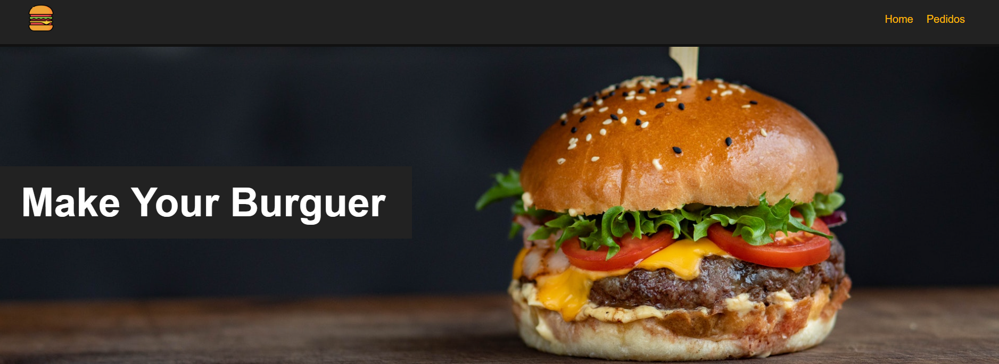

<h1 align="center">
  💻 App Vue.js
</h1>

✅ Front Vue.js
✅ Design Responsivo

## 🔥 Rodar Aplicação:
- Vue.js (porta 8080): `npm run serve`
- Json serve (porta 3000): `npm server`

## ✨ Objetivo
- Aplicação WEB Vue.js simples com requisições HTTP
- Cadastro, atualização e exclusão de pedidos
- Exibir listagem de pedidos cadastrados

## 😬 Instalações necessárias:
- Git (Teste): `git -v`
- Node.js (Teste): `node -v` e `npm -v`
- VS Code
- Vue CLI: `npm install -g @vue/cli` (Teste): `vue --version`

## 👶 Dependências: `npm install`
- `npm install json-server axios`

### Projeto desenvolvido pelo canal `Hora de Codar`

## 💼 Tecnologias utilizadas:

- #### Vue.js (Front)
  - HTML
  - CSS
  - JavaScript

<h2>🦄 Autor</h2>

<table>
  <tr>
    <td align="center">
      <a href="https://github.com/bhigoreduardo">
         
        
          <b>Higor Eduardo</b>
        
      </a>
    </td>
  </tr>
</table>