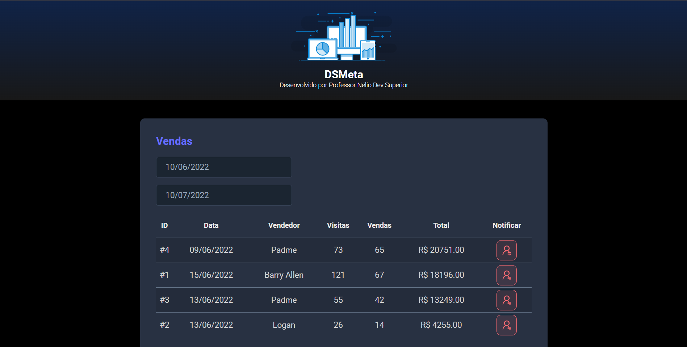

<h1 align="center">
  💻 DSMETA - Dashboard
</h1>

✅ Projeto Spring-React.
✅ Design Responsivo.

### Acesse aqui 👉 [DSMETA DASHBOARD](https://dashboard-dsmeta-higor.netlify.app/)

- Rodar o projeto (development): `yarn dev`
- Aplicação rodando no server: `http:localhost:5173`
- Instalar as dependências: `yarn`

## 📚 Seções

O projeto é composto por uma página:

- **Home:** Nele temos uma aplicação Request API React-Spring;

## 💼 Tecnologias utilizadas

Para o desenvolvimento deste site utilizei as seguintes tecnologias:

- React:
  - HTML
  - CSS
  - TypeScript
- Java:
  - Spring
- SQL

<h2>🦄 Autor</h2>

<table>
  <tr>
    <td align="center">
      <a href="https://github.com/bhigoreduardo">
         
        
          <b>Higor Eduardo</b>
        
      </a>
    </td>
  </tr>
</table>
